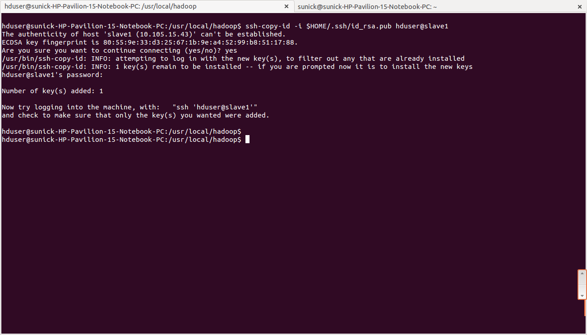

===================
HADOOP INSTALLATION
===================

This section refers to the installation settings of Hadoop on a standalone system
as well as on a system existing as a node in a cluster.

SINGLE-NODE INSTALLATION
************************

Running Hadoop on Ubuntu (Single node cluster setup)
====================================================

The report here will describe the required steps for setting up a single-node Hadoop cluster backed by the Hadoop Distributed File System, running on Ubuntu Linux.
Hadoop is a framework written in Java for running applications on large clusters of commodity hardware and incorporates features similar to those of the Google File System (GFS) and of the MapReduce computing paradigm. Hadoop’s HDFS is a highly fault-tolerant distributed file system and, like Hadoop in general, designed to be deployed on low-cost hardware. It provides high throughput access to application data and is suitable for applications that have large data sets.

Before we start, we will understand the meaning of the following:

DataNode:
---------
A DataNode stores data in the Hadoop File System. A functional file system has more than one DataNode, with the data replicated across them.

NameNode:
---------
The NameNode is the centrepiece of an HDFS file system. It keeps the directory of all files in the file system, and tracks where across the cluster the file data is kept. It does not store the data of these file itself.

Jobtracker:
-----------
The Jobtracker is the service within hadoop that farms out MapReduce to specific nodes in the cluster, ideally the nodes that have the data, or atleast are in the same rack.

TaskTracker:
------------
A TaskTracker is a node in the cluster that accepts tasks- Map, Reduce and Shuffle operatons – from a Job Tracker.

Secondary Namenode:
-------------------
Secondary Namenode whole purpose is to have a checkpoint in HDFS. It is just a helper node for namenode.

Prerequisites
=============

Java 6 JDK
----------
Hadoop requires a working Java 1.5+ (aka Java 5) installation.

Update the source list ::

    user@ubuntu:~$  sudo apt-get update

.. figure:: _static/images/1.png
   :height: 700 px
   :width: 1000 px
   :scale: 50 %
   :alt: Use case diagram of the Ticketing System
   :align: center

or

Install Sun Java 6 JDK

.. figure:: _static/images/2.png
   :height: 700 px
   :width: 1000 px
   :scale: 50 %
   :alt: Use case diagram of the Ticketing System
   :align: center

Note:
+++++
If you already have Java JDK installed on your system, then you need not run the above command.

To install it ::

    user@ubuntu:~$ sudo apt-get install sun-java6-jdk

The full JDK which will be placed in /usr/lib/jvm/java-6-openjdk-amd64
After installation, check whether java JDK is correctly installed or not, with the following command ::

    user@ubuntu:~$ java -version

Adding a dedicated Hadoop system user
-------------------------------------

We will use a dedicated Hadoop user account for running Hadoop. ::

    user@ubuntu:~$ sudo addgroup hadoop_group
    user@ubuntu:~$ sudo adduser --ingroup hadoop_group hduser1

.. figure:: _static/images/4.png
   :height: 700 px
   :width: 1000 px
   :scale: 50 %
   :alt: Use case diagram of the Ticketing System
   :align: center

This will add the user hduser1 and the group hadoop_group to the local machine.
Add hduser1 to the sudo group ::

    user@ubuntu:~$ sudo adduser hduser1 sudo

Configuring SSH
---------------

The hadoop control scripts rely on SSH to peform cluster-wide operations. For example, there is a script for stopping and starting all the daemons in the clusters. To work seamlessly, SSh needs to be etup to allow password-less login for the hadoop user from machines in the cluster. The simplest ay to achive this is to generate a public/private key pair, and it will be shared across the cluster.

Hadoop requires SSH access to manage its nodes, i.e. remote machines plus your local machine. For our single-node setup of Hadoop, we therefore need to configure SSH access to localhost for the hduser user we created in the earlier.

We have to generate an SSH key for the hduser user. ::

    user@ubuntu:~$ su – hduser1
    hduser1@ubuntu:~$ ssh-keygen -t rsa -P ""

.. figure:: _static/images/5.png
   :height: 700 px
   :width: 1000 px
   :scale: 50 %
   :alt: Use case diagram of the Ticketing System
   :align: center

The second line will create an RSA key pair with an empty password.

Note:
+++++
P “”, here indicates an empty password

You have to enable SSH access to your local machine with this newly created key which is done by the following command. ::

    hduser1@ubuntu:~$ 	cat $HOME/.ssh/id_rsa.pub >> $HOME/.ssh/authorized_keys

The final step is to test the SSH setup by connecting to the local machine with the hduser1 user.
The step is also needed to save your local machine’s host key fingerprint to the hduser user’s known hosts file. ::

    hduser@ubuntu:~$ ssh localhost

.. figure:: _static/images/6.png
   :height: 700 px
   :width: 1000 px
   :scale: 50 %
   :alt: Use case diagram of the Ticketing System
   :align: center

If the SSH connection fails, we can try the following (optional):

- Enable debugging with ssh -vvv localhost and investigate the error in detail.
- Check the SSH server configuration in /etc/ssh/sshd_config.  If you made any changes to the SSH server configuration file, you can force a configuration reload with sudo /etc/init.d/ssh reload.

INSTALLATION
============

Main Installation
-----------------

- Now, I will start by switching to hduser ::

    hduser@ubuntu:~$ su - hduser1

- Now, download and extract Hadoop 1.2.0
- Setup Environment Variables for Hadoop

Add the following entries to .bashrc file ::

    # Set Hadoop-related environment variables
    export HADOOP_HOME=/usr/local/hadoop
    # Add Hadoop bin/ directory to PATH
    export PATH= $PATH:$HADOOP_HOME/bin

Configuration
-------------

hadoop-env.sh
+++++++++++++

Change the file:
conf/hadoop-env.sh ::

    #export JAVA_HOME=/usr/lib/j2sdk1.5-sun

to
in the same file ::

    # export JAVA_HOME=/usr/lib/jvm/java-6-openjdk-amd64  (for 64 bit)
    # export JAVA_HOME=/usr/lib/jvm/java-6-openjdk-amd64  (for 32 bit)

conf/*-site.xml
+++++++++++++++

Now we create the directory and set the required ownerships and permissions ::

    hduser@ubuntu:~$ sudo mkdir -p /app/hadoop/tmp
    hduser@ubuntu:~$ sudo chown hduser:hadoop /app/hadoop/tmp
    hduser@ubuntu:~$ sudo chmod 750 /app/hadoop/tmp

The last line gives reading and writing permissions to the /app/hadoop/tmp directory

- Error: If you forget to set the required ownerships and permissions, you will see a java.io.IO Exception when you try to format the name node.

Paste the following between <configuration>

- In file conf/core-site.xml ::

    <property>
        <name>hadoop.tmp.dir</name>
        <value>/app/hadoop/tmp</value>
        <description>A base for other temporary directories.</description>
    </property>

    <property>
        <name>fs.default.name</name>
        <value>hdfs://localhost:54310</value>
        <description>The name of the default file system.  A URI whose
        scheme and authority determine the FileSystem implementation.  The
        uri's scheme determines the config property (fs.SCHEME.impl) naming
        the FileSystem implementation class.  The uri's authority is used to
        determine the host, port, etc. for a filesystem.</description>
    </property>

- In file conf/mapred-site.xml ::

    <property>
    <name>mapred.job.tracker</name>
        <value>localhost:54311</value>
        <description>The host and port that the MapReduce job tracker runs
        at.  If "local", then jobs are run in-process as a single map
        and reduce task.
        </description>
    </property>

- In file conf/hdfs-site.xml ::

    <property>
        <name>dfs.replication</name>
        <value>1</value>
        <description>Default block replication.
        The actual number of replications can be specified when the file is created.
        The default is used if replication is not specified in create time.
        </description>
    </property>

Formatting the HDFS filesystem via the NameNode
-----------------------------------------------

To format the filesystem (which simply initializes the directory specified by the dfs.name.dir variable).
Run the command ::

    hduser@ubuntu:~$ /usr/local/hadoop/bin/hadoop namenode –format

.. figure:: _static/images/7.png
   :height: 700 px
   :width: 1000 px
   :scale: 50 %
   :alt: Use case diagram of the Ticketing System
   :align: center

Starting your single-node cluster
---------------------------------

Before starting the cluster, we need to give the required permissions to the directory with the following command ::

    hduser@ubuntu:~$ sudo chmod -R 777 /usr/local/hadoop

Run the command ::

    hduser@ubuntu:~$ /usr/local/hadoop/bin/start-all.sh

This will startup a Namenode, Datanode, Jobtracker and a Tasktracker on the machine. ::

    hduser@ubuntu:/usr/local/hadoop$ jps

Errors:
+++++++

1. If by chance your datanode is not starting, then you have to erase the contents of the folder /app/hadoop/tmp
    The command that can be used ::

        hduser@ubuntu:~:$ sudo rm –Rf /app/hadoop/tmp/*

2. You can also check with netstat if Hadoop is listening on the configured ports.
    The command that can be used ::

        hduser@ubuntu:~$ sudo netstat -plten | grep java

3. Errors if any, examine the log files in the /logs/ directory.

Stopping your single-node cluster
---------------------------------

Run the command to stop all the daemons running on your machine. ::

    hduser@ubuntu:~$ /usr/local/hadoop/bin/stop-all.sh

ERROR POINTS:
+++++++++++++

If datanode is not starting, then clear the tmp folder before formatting the namenode using the following command ::

    hduser@ubuntu:~$ rm -Rf /app/hadoop/tmp/*

Note:
+++++
- The masters and slaves file should contain localhost.
- In /etc/hosts, the ip of the system should be given with the alias as localhost.
- Set the java home path in hadoop-env.sh as well bashrc.

MULTI-NODE INSTALLATION
***********************

Running Hadoop on Ubuntu Linux (Multi-Node Cluster)
===================================================

From single-node clusters to a multi-node cluster
-------------------------------------------------

We will build a multi-node cluster merge two or more single-node clusters into one multi-node cluster in which one Ubuntu box will become the designated master but also act as a slave , and the other box will become only a slave.

.. figure:: _static/images/9.png
   :height: 700 px
   :width: 1000 px
   :scale: 50 %
   :alt: Use case diagram of the Ticketing System
   :align: center

Prerequisites
=============

Configuring single-node clusters first,here we have used two single node clusters.
Shutdown each single-node cluster with the following command ::

    user@ubuntu:~$  bin/stop-all.sh

Networking
==========

- The easiest is to put both machines in the same network with regard to hardware and   software configuration.

- Update /etc/hosts on both machines .Put the alias to the ip addresses of all the machines. Here we are creating a cluster of 2 machines , one is master and other is slave 1 ::

    hduser@master:$  cd /etc/hosts

- Add the following lines for two node cluster ::

     10.105.15.78    master  (IP address of the master node)
     10.105.15.43    slave1   (IP address of the slave node)

.. figure:: _static/images/10.png
   :height: 700 px
   :width: 1000 px
   :scale: 50 %
   :alt: Use case diagram of the Ticketing System
   :align: center

SSH access
==========
The hduser user on the master (aka hduser@master) must be able to connect:

1. to its own user account on the master - i.e. ssh master in this context.
2. to the hduser user account on the slave (i.e. hduser@slave1) via a password-less SSH 	login.

- Add the hduser@master public SSH key using the following command ::

    hduser@master:~$  ssh-copy-id -i $HOME/.ssh/id_rsa.pub hduser@slave1

- Connect with user hduser from the master to the user account hduser on the slave.

1. From master to master ::

    hduser@master:~$  ssh master

2. From master to slave ::

    hduser@master:~$  ssh slave1

Hadoop
======

Cluster Overview
----------------
This will describe how to configure one Ubuntu box as a master node and the other Ubuntu box as a slave node.

Configuration
-------------

conf/masters
++++++++++++
The machine on which bin/start-dfs.sh is running will become the primary NameNode.
This file should be updated on all the nodes. Open the masters file in the conf directory ::

    hduser@master/slave :~$ /usr/local/hadoop/conf
    hduser@master/slave :~$ sudo gedit masters

Add the following line ::

    Master

.. figure:: _static/images/14.png
   :height: 700 px
   :width: 1000 px
   :scale: 50 %
   :alt: Use case diagram of the Ticketing System
   :align: center

conf/slaves
+++++++++++
This file should be updated on all the nodes as master is also a slave.
Open the slaves file in the conf directory ::

    hduser@master/slave:~/usr/local/hadoop/conf$ sudo gedit slaves

Add the following lines ::

    Master
    Slave1

.. figure:: _static/images/15.png
   :height: 700 px
   :width: 1000 px
   :scale: 50 %
   :alt: Use case diagram of the Ticketing System
   :align: center

conf/*-site.xml (all machines)
++++++++++++++++++++++++++++++

Open this file in the conf directory ::

    hduser@master:~/usr/local/hadoop/conf$ sudo gedit core-site.xml

Change the fs.default.name parameter (in conf/core-site.xml), which specifies the NameNode (the HDFS master) host and port.

conf/core-site.xml (ALL machines .ie. Master as well as slave) ::

    <property>
        <name>fs.default.name</name>
        <value>hdfs://master:54310</value>
        <description>The name of the default file system.  A URI whose
        scheme and authority determine the FileSystem implementation.  The
        uri's scheme determines the config property (fs.SCHEME.impl) naming
        the FileSystem implementation class.  The uri's authority is used to
        determine the host, port, etc. for a filesystem.</description>
    </property>

.. figure:: _static/images/16.png
   :height: 700 px
   :width: 1000 px
   :scale: 50 %
   :alt: Use case diagram of the Ticketing System
   :align: center

conf/mapred-site.xml
++++++++++++++++++++

Open this file in the conf directory ::

    hduser@master:~$  /usr/local/hadoop/conf
    hduser@master:~$  sudo gedit mapred-site.xml

Change the mapred.job.tracker parameter (in conf/mapred-site.xml), which specifies the JobTracker (MapReduce master) host and port.

conf/mapred-site.xml (ALL machines) ::

    <property>
        <name>mapred.job.tracker</name>
        <value>master:54311</value>
        <description>The host and port that the MapReduce job tracker runs
        at.  If "local", then jobs are run in-process as a single map
        and reduce task.
        </description>
    </property>

.. figure:: _static/images/17.png
   :height: 700 px
   :width: 1000 px
   :scale: 50 %
   :alt: Use case diagram of the Ticketing System
   :align: center

conf/hdfs-site.xml
++++++++++++++++++

Open this file in the conf directory ::

    hduser@master:~$  /usr/local/hadoop/conf
    hduser@master:~$  sudo gedit hdfs-site.xml

Change the dfs.replication parameter (in conf/hdfs-site.xml) which specifies the default block replication.
We have two nodes available, so we set dfs.replication to 2.

conf/hdfs-site.xml (ALL machines)
+++++++++++++++++++++++++++++++++

Changes to be made ::

    <property>
    <name>dfs.replication</name>
    <value>2</value>
    <description>Default block replication.
        The actual number of replications can be specified when the file is created.
        The default is used if replication is not specified in create time.
        </description>
    </property>

Formatting the HDFS filesystem via the NameNode
-----------------------------------------------

Format the cluster’s HDFS file system ::

    hduser@master:~/usr/local/hadoop$ bin/hadoop namenode -format

Starting the multi-node cluster
-------------------------------

Starting the cluster is performed in two steps.

1. We begin with starting the HDFS daemons: the NameNode daemon is started on master, and DataNode daemons are started on all slaves (here: master and slave).

2. Then we start the MapReduce daemons: the JobTracker is started on master, and TaskTracker daemons are started on all slaves (here: master and slave).

Cluster is started by running the commnd on master ::

    hduser@master:~$   /usr/local/hadoop
    hduser@master:~$   bin/start-all.sh

By this command:

- The NameNode daemon is started on master, and DataNode daemons are started on all slaves (here: master and slave).
- The JobTracker is started on master, and TaskTracker daemons are started on all slaves (here: master and slave)

To check the daemons running , run the following commands ::

    hduser@master:~$  jps

.. figure:: _static/images/21.png
   :height: 700 px
   :width: 1000 px
   :scale: 50 %
   :alt: Use case diagram of the Ticketing System
   :align: center

On slave, datanode and jobtracker should run. ::

    hduser@slave:~/usr/local/hadoop$ jps

.. figure:: _static/images/22.png
   :height: 700 px
   :width: 1000 px
   :scale: 50 %
   :alt: Use case diagram of the Ticketing System
   :align: center

Stopping the multi-node cluster
-------------------------------

To stop the multinode cluster , run the following command on master pc ::

    hduser@master:~$ cd /usr/local/hadoop
    hduser@master:~/usr/local/hadoop$ bin/stop-all.sh

ERROR POINTS:
+++++++++++++

1. Number of slaves = Number of replications in hdfs-site.xml
    also number of slaves = all slaves + master(if master is also considered to be a slave)

2. When you start the cluster, clear the tmp directory on all the nodes (master+slaves) using the following command ::

    hduser@master:~$   rm -Rf /app/hadoop/tmp/*

3. Configuration of /etc/hosts , masters  and slaves files on both the masters and the slaves nodes should be the same.

4. If namenode is not getting started run the following commands:

    - To give all permissions  of hadoop folder to hduser ::

        hduser@master:~$  sudo chmod -R 777 /app/hadoop

    - This command deletes the junk files which gets stored in tmp folder of hadoop ::

        hduser@master:~$  sudo rm -Rf /app/hadoop/tmp/*

.. figure:: _static/images/24.png
   :height: 700 px
   :width: 1000 px
   :scale: 50 %
   :alt: Use case diagram of the Ticketing System
   :align: center

